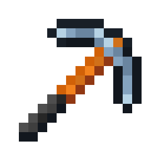
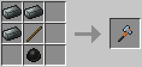
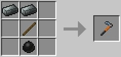
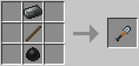
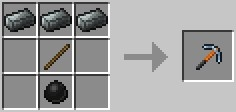
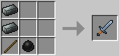
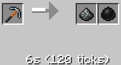
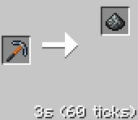

    

# Oritech Steel Tools

A small toolset expansion for the **Oritech** ecosystem. This mod introduces a durable set of steel tools that sit between Iron and Diamond tiers, providing a meaningful progression path for industrial-minded players.

This toolkit includes:
*  **Steel Sword**
*  **Steel Pickaxe**
*  **Steel Axe**
*  **Steel Shovel**
*  **Steel Hoe**

### Tool Statistics
|||
| :--- | :--- |
| Durability | **832** |
| Mining Level | **Iron** |
| Damage/Mining speed | Balanced between Iron and Diamond |

---

### Crafting & Processing
If you have managed to produce **Silicon**, these tools offer a much easier alternative to Diamond gear during the early-to-mid stages of the game.
**Crafting:** Crafting requires **Steel Ingots** and **Silicon** from the Oritech mod.

|  |  |  |
|:--------------:|:--------------:|:--------------:|
|  |  |                |

**Pulverizer and Fragment forge processing:** You can recycle and process these tools using Oritech's mechanical systems just like other metal items.

|  |  |
|:--------------------:|:--------------------:|

---

### Installation

1. Make sure you have **Oritech** installed.
4. Works on both **Fabric** and **NeoForge**.